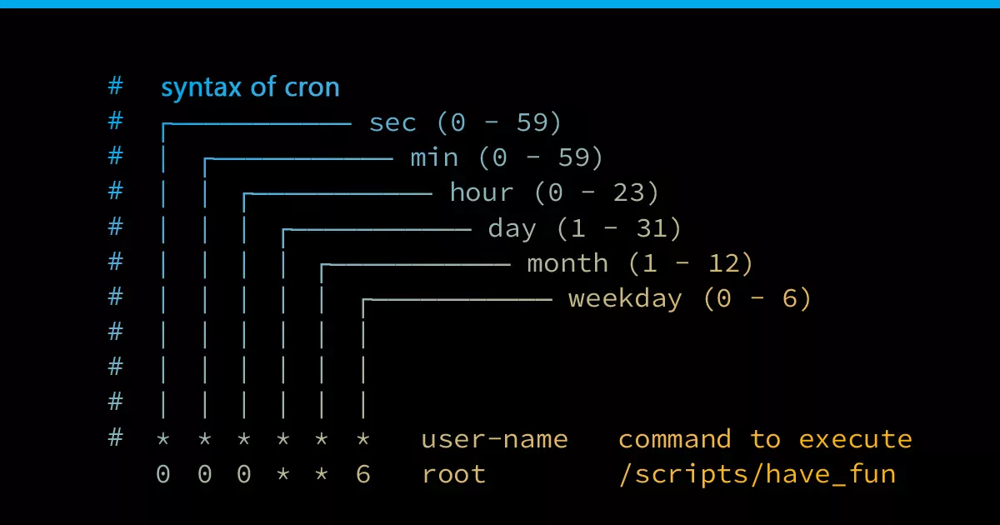
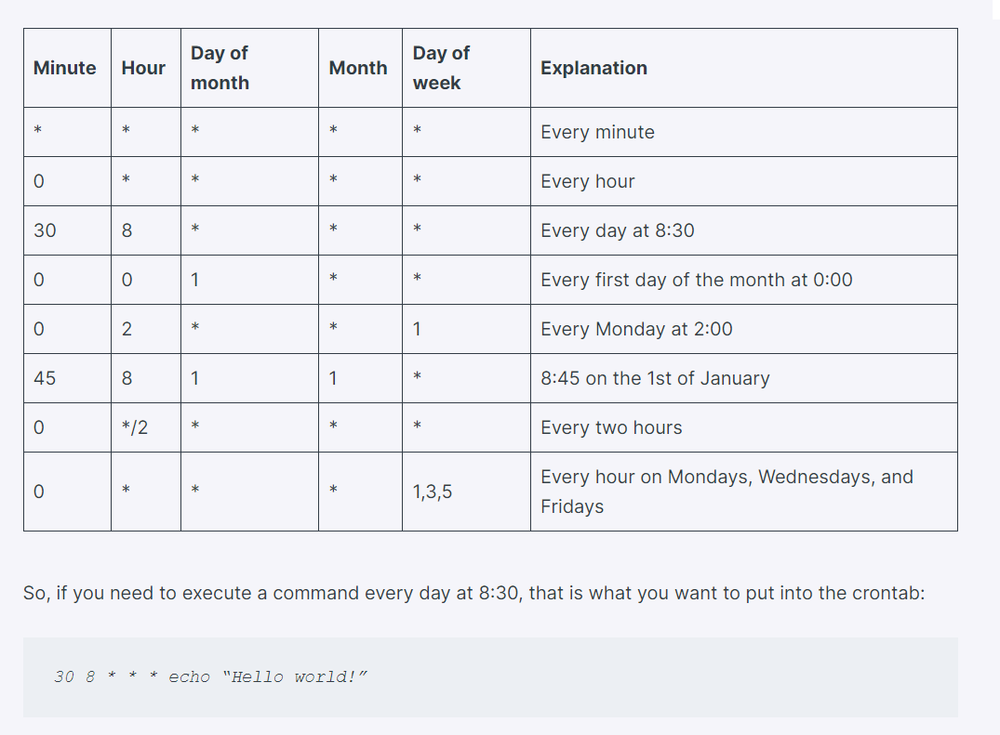

## Automating Tasks with Job Scheduling

### *Cron Cheat Sheet* 

   
  <code>Detail Cron task command</code>

   
  <code>Syntax of Cron Task</code>

- `crontab -e`: Select which one to edit 
- `00 2 * * 0 backup /bin/systembackup.sh`

    `00`: At the top of the hour (00),

    `2`: Of the second hour (2),

    `*`: Of any day of the month (*),

    `*`: Of any month (*),

    `0`: On Sunday (0),

    `backup`: As the backup user,

    `/bin/systembackup.sh`: Execute the script at /bin/systembackup.sh.

- `00 2 15,30 * * backup /root/systembackup.sh`: 

    If you only wanted the backup to run on the 15th and 30th of every month, regardless of what days of the week those dates fell on

- `00 23 * * 1-5 backup /root/systembackup.sh`

    This job would run at 11 PM (hour 23), every day of the month, every month, but only on Monday through Friday (days 1–5).

### *Using crontab to Schedule Your MySQLscanner*

- `sudo crontab -e` Add this to below `00 2 * 6-8 0,6 user /usr/share/MySQLsscanner.sh`

### *Crontab Shortcuts* 
- `['@yearly', '@annually', '@monthly', '@weekly', '@daily', '@midnight', '@noon', '@reboot']`
  
  e.g: `@midnight      user   /usr/share/MySQLsscanner.sh`

### *Using `rc Script` to Run Jobs a Startup* 
- `rc`: Is found in `/etc/init.d/rc`

### *Linux Runlevels*
- `0 `: Halt the system
- `1`: Single-user/minimal mode
- `2–5`: Multiuser modes
- `6`: Reboot the system

### *Adding Services to rc.d* 
- `update-rc.d <name of the script or service> {remove | defaults | disable | enable}`
- `update-rc.d postgresql defaults`: Startup postgresql 

### *Adding Services to Your Bootup via a GUI* 
- `sudo apt update && sudo apt install rcconf -y`
- `rcconf`: Space to select one(s) as you want and then `Tab` to `Ok`
- `rcconf`: Again to confirm is selected...

### *Exercise* 
- 1.`Do it with your own`:
