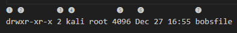

## Chapter 5 Controlling file and Directory Permissions 

- `sudo chown kali /tmp/bobsfile`: Change ownership dir `tmp/bobsfile` to kali 

To transfer ownership of a file from one group to another, we can use the `chgrp` (or change group) command.
e.g `chgrp security newIDS`

- ➊ The file type (this is the first character listed)

- ➋ The permissions on the file for owner, groups, and users, respectively (this is the rest of this section)

- ➌ The number of links (This topic is beyond the scope of the book.)

- ➍ The owner of the file

- ➎ The size of the file in bytes

- ➏ When the file was created or last modified

- ➐ The name of the file

- `chmod`: Change permission 
- `stat -c "%a %n" *`: List Octal permission current directory

- `chmod kali-w bobsfile`: Remove user kali's write permission 
- `chmod kali+w, root+x bobsfile`: Set multi permissions and users (`kali` and `root`)

`sudo chmod 4644 fileName`: Sets the file permissions to be read and write for the owner and read-only for the group and others, 
without changing the behavior associated with the setuid bit, as it is typically used with executable files.

`find / -user root -perm -4000`: With this command, start looking at the top of the filesystem with the / syntax. 
It then looks everywhere below / for files that are owned by root, specified with user root, 
and that have the SUID permission bit set (-perm -4000).

`pirntenv`: list all your current Linux environment variables by running the command without any options or parameters

### Exercise 
- 1.`ls -l secretFile`
- 2.`chmod +x secretFile`
- 3.`sudo 777 secretFile`
- 4.`sudo chown -R www-data:www:data /var/www/{yourProjectDir}`
- 5.`find / -type f -perm -2000`
