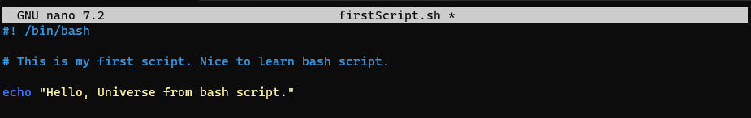

## Chapter 8 Bash Scripting 

- `#! /bin/bash`

You then follow the shebang (#!) with /bin/bash to indicate that you want the operating system to use the bash shell interpreter. 

As you’ll see in later chapters, you could also use the shebang to use other interpreters, such as Perl or Python. 

Here, you want to use the bash interpreter.

- `sudo nano firstScript.sh`: Contents below

- `sudo chmod +x firstScript.sh`: Set execute permission to run file

- `./firstScript.sh`: Run file

- `echo "What is your favorite programming language?" read language`

- `Black, White and Gray Hacker`

Black hat hackers are those with malicious intentions, such as stealing credit card numbers or defacing websites. 

White hat hackers are those with good intentions, such as helping software developers or system administrators make their systems more secure. 

Gray hat hackers are those who tend to move between these two extremes.

- `nmap <type of scan><target IP><optionally, target port>`

- e.g: `nmap -sT 172.30.238.97`

- `nmap -sT 172.30.238.97 -p 3306`

- `nmap -sT 192.168.181.0/24 -p 3306 >/dev/null -oG MySQLscan`

- `cat MySQLscan | grep open > MySQLscan2`

### Explanation:

- `nmap -sT 192.168.181.0/24 -p 3306`: This command scans the IP range 192.168.181.0 to 192.168.181.255 for the open TCP port 3306 (MySQL). 

-sT specifies a TCP connect scan.

- `>/dev/null`: This part discards the normal output of the nmap command, directing it to /dev/null. 

It's often used when you're only interested in the final output file and don't want to see the detailed scan results on the terminal.

- `-oG MySQLscan`: This specifies that the output of the scan should be in "grepable" format and saved to a file named MySQLscan.

- `cat MySQLscan | grep open > MySQLscan2`: This command reads the content of the MySQLscan file, searches for lines containing "open" 

(indicating an open port), and saves the result to a new file named MySQLscan2.

The end result is a file (MySQLscan2) containing information about hosts in the specified IP range that have the MySQL port (3306) open.

Keep in mind that scanning networks or systems without proper authorization is against the terms of service of many networks, 

and you should only perform such actions on systems you own or have explicit permission to test.

### Exercise 
- 1.`Check above firstScriipt.sh`
- 2.`MSSQLScanner.sh`
- 3.`MSSQLScannerImprove.sh`
